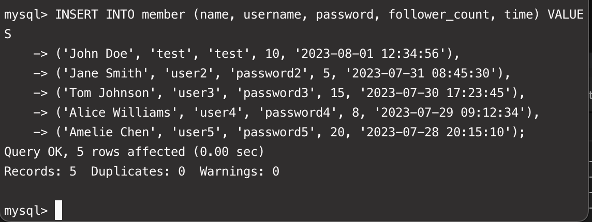
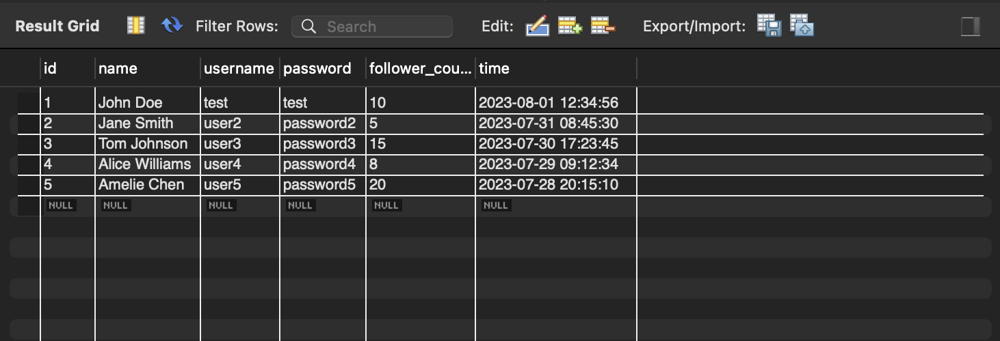
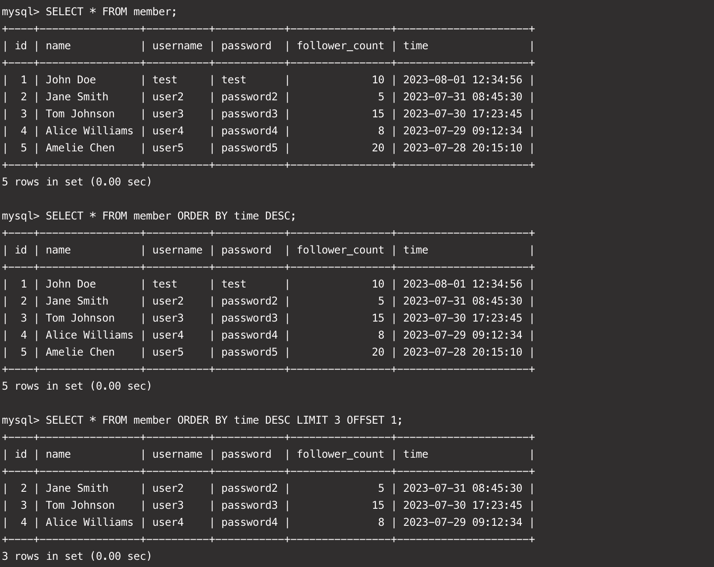
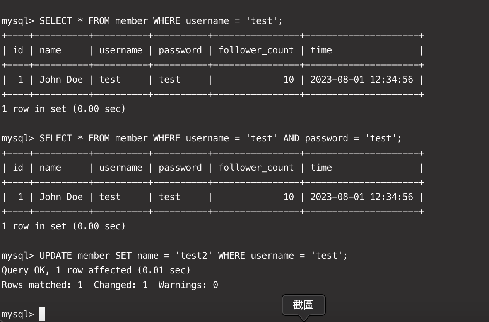
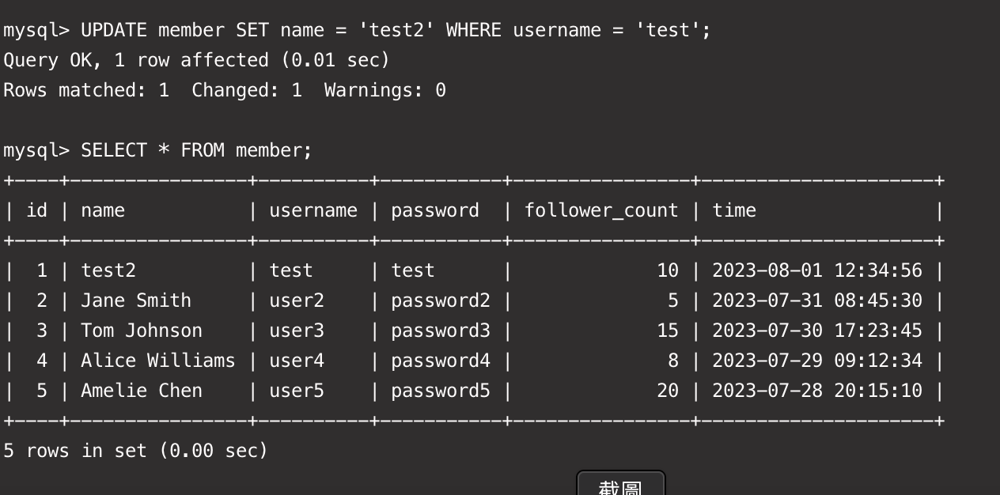
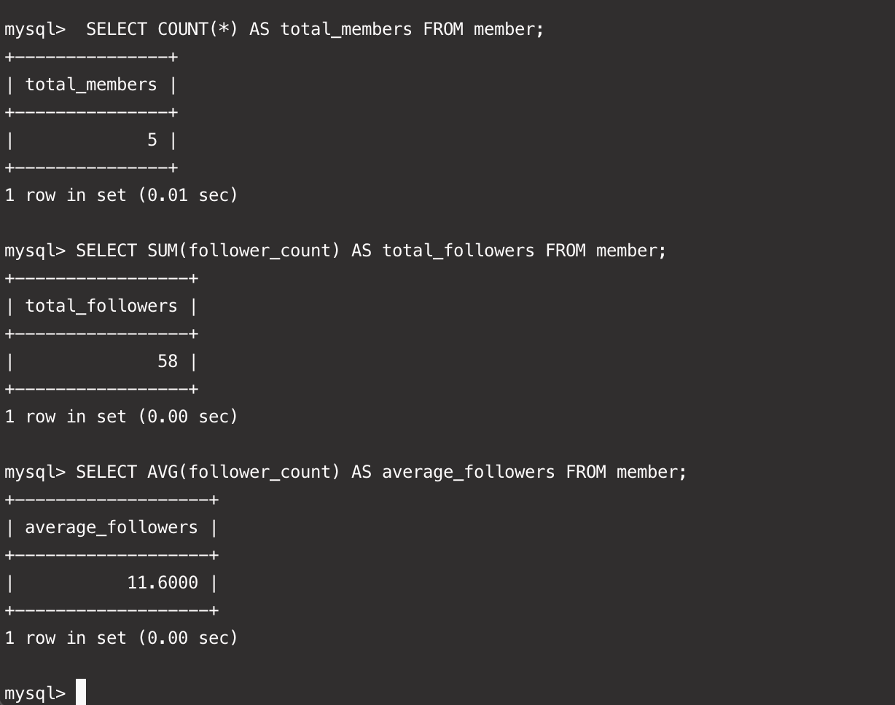
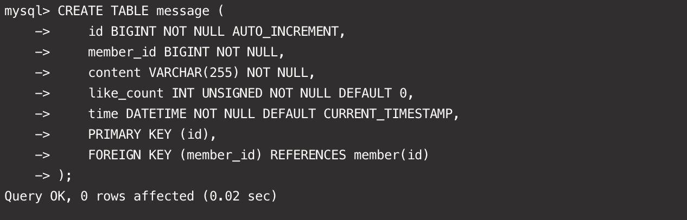
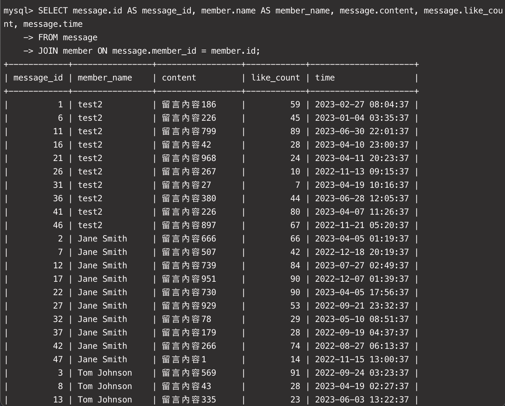
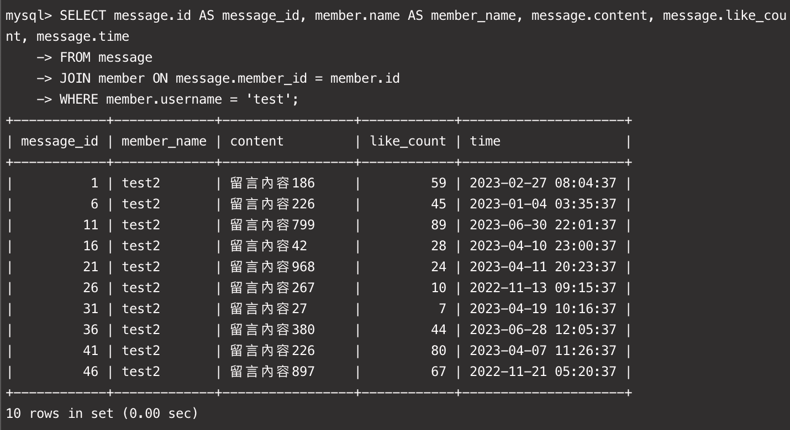
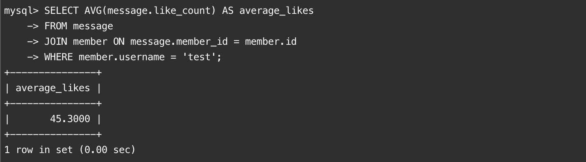

# 要求 3：

指令：

```sql
/* 要求三 */

INSERT INTO member (name, username, password, follower_count, time) VALUES
('John Doe', 'test', 'test', 10, '2023-08-01 12:34:56'),
('Jane Smith', 'user2', 'password2', 5, '2023-07-31 08:45:30'),
('Tom Johnson', 'user3', 'password3', 15, '2023-07-30 17:23:45'),
('Alice Williams', 'user4', 'password4', 8, '2023-07-29 09:12:34'),
('Amelie Chen', 'user5', 'password5', 20, '2023-07-28 20:15:10');

SELECT * FROM member;

SELECT * FROM member ORDER BY time DESC;

SELECT * FROM member ORDER BY time DESC LIMIT 3 OFFSET 1;

SELECT * FROM member WHERE username = 'test';

SELECT * FROM member WHERE username = 'test' AND password = 'test';

UPDATE member SET name = 'test2' WHERE username = 'test';

```

截圖：











# 要求 4：

指令：

```sql
/* 要求四 */
SELECT COUNT(*) AS total_members FROM member;
SELECT SUM(follower_count) AS total_followers FROM member;
SELECT AVG(follower_count) AS average_followers FROM member;
```

截圖：



# 要求 5：

指令：

```sql
sql
/* 在資料庫中，建立新資料表紀錄留⾔資訊，取名字為 message。 */
CREATE TABLE message (
    id BIGINT NOT NULL AUTO_INCREMENT,
    member_id BIGINT NOT NULL,
    content VARCHAR(255) NOT NULL,
    like_count INT UNSIGNED NOT NULL DEFAULT 0,
    time DATETIME NOT NULL DEFAULT CURRENT_TIMESTAMP,
    PRIMARY KEY (id),
    FOREIGN KEY (member_id) REFERENCES member(id)
);

INSERT INTO message (member_id, content, like_count, time)
SELECT
    m.id AS member_id,
    CONCAT('留言內容', FLOOR(RAND() * 1000)) AS content,
    FLOOR(RAND() * 100) AS like_count,
    NOW() - INTERVAL FLOOR(RAND() * 365) DAY - INTERVAL FLOOR(RAND() * 24) HOUR - INTERVAL FLOOR(RAND() * 60) MINUTE AS time
FROM
    member m
CROSS JOIN
    (SELECT 1 AS n UNION SELECT 2 UNION SELECT 3 UNION SELECT 4 UNION SELECT 5) t1,
    (SELECT 1 AS n UNION SELECT 2 UNION SELECT 3 UNION SELECT 4 UNION SELECT 5) t2
LIMIT 50;

/* 查看資料 */
SELECT * FROM message;

/* 使⽤ SELECT 搭配 JOIN 語法，取得所有留⾔，結果須包含留⾔者的姓名。 */
SELECT message.id AS message_id, member.name AS member_name, message.content, message.like_count, message.time
FROM message
JOIN member ON message.member_id = member.id;

/*使⽤ SELECT 搭配 JOIN 語法，取得 member 資料表中欄位 username 是 test 的所有
留⾔，資料中須包含留⾔者的姓名。*/
SELECT message.id AS message_id, member.name AS member_name, message.content, message.like_count, message.time
FROM message
JOIN member ON message.member_id = member.id
WHERE member.username = 'test';

/*使⽤ SELECT、SQL Aggregate Functions 搭配 JOIN 語法，取得 member 資料表中
欄位 username 是 test 的所有留⾔平均按讚數。*/
SELECT AVG(message.like_count) AS average_likes
FROM message
JOIN member ON message.member_id = member.id
WHERE member.username = 'test';
```

截圖：








